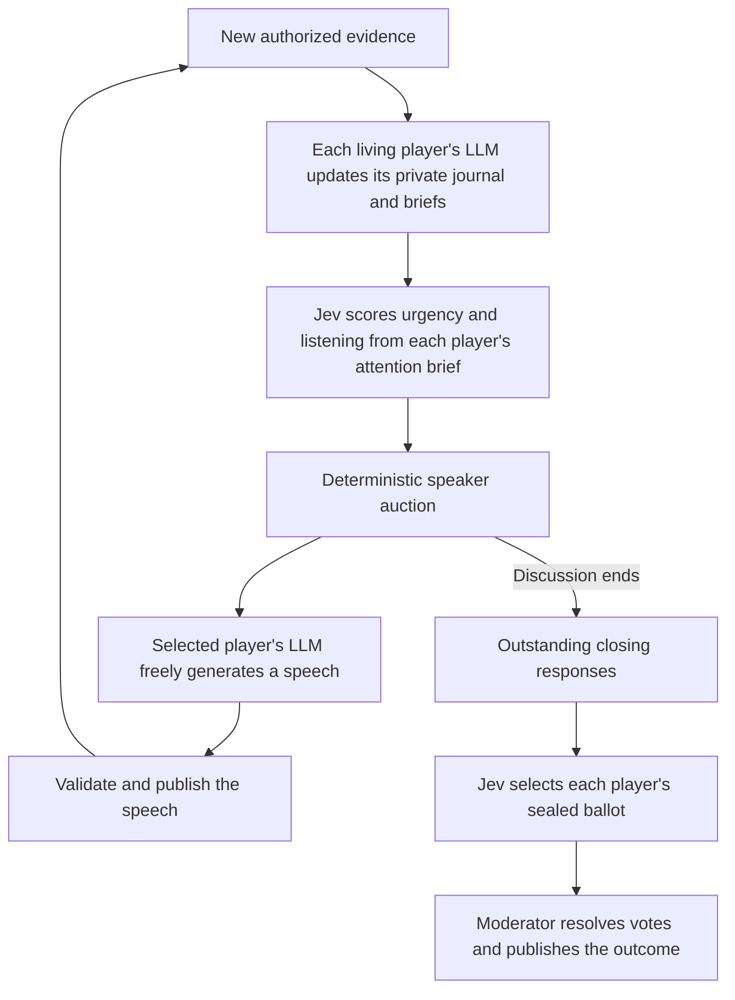
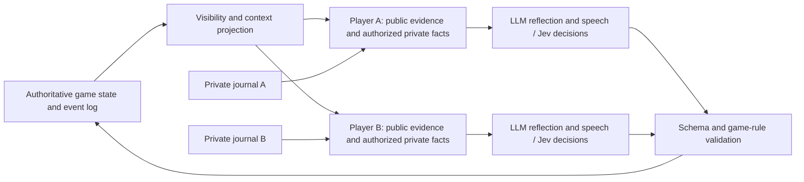

# Moon Council

**An experiment in peer multi-agent interaction under information asymmetry.**

What happens when agents share a conversation, but not their knowledge or goals? Moon Council
studies how they listen, form beliefs, persuade, deceive, and coordinate. Each player has a private
view and journal; a deterministic moderator controls the environment and records what happened.

**Werewolf is the current testbed.** Hidden roles, conflicting objectives, private observations, and
public votes provide a useful proxy for these interactions. The research question is broader than
playing Werewolf, although the implementation currently supports that game rather than arbitrary
multi-agent environments.

## The speaker auction

The distinctive mechanism is an auction for the conversational floor. Agents express both **how much
they want to speak** and **whom they want to hear from**. The scheduler combines those signals:

```text
speaker priority = (configured bias + urge) × normalized listener interest
```

Listener interest is the mean rating from other submitted listeners, normalized across willing,
eligible speakers. A player cannot raise its own score by rating itself. If all listener interest is
zero, the scheduler gives candidates equal listening weight; ties use a seeded order.

This makes attention a constraint on urgency. A player that keeps demanding the floor can lose
priority if others stop wanting to listen. That is an effect of the listeners' current judgments,
not a separate reputation balance or a guaranteed deterrent to domination. Opening opportunities,
follow-up limits, and response dockets add explicit scheduling safeguards.

Only the selected player generates a full speech. Jev scores the bids; the selected language model
chooses what to say. See the [auction walkthrough](docs/SPEAKER_AUCTION.md) for examples and edge
cases.

## One discussion turn

This is the current Jev + LLM workflow; an LLM-only mode is also available for comparison.



The LLM does the open-ended work: reflection, strategy, speech, and journal compaction. Jev makes
bounded decisions from the acting player's perspective: urgency, listening scores, votes, and legal
night actions. It receives a current action or attention brief, relevant verified facts, and legal
choices. It does not choose speech topics. The moderator validates every action and alone changes
the game state.

## Separate players, shared world



Isolation is enforced by the application's projections and independent model requests. Players do
not share journals or a model conversation. This is an information boundary, not a separate VM per
player. The local observer can inspect public, player, team, or moderator perspectives; moderator
views and exports contain spoilers and private game data.

Private journals are explicit application artifacts describing beliefs and intentions. They are not
provider-hidden reasoning traces. The [architecture guide](docs/ARCHITECTURE.md) explains the trust
boundaries, event history, and package responsibilities.

## Try it locally

Use Node 24 (the exact version is in `.nvmrc`) and a native Linux working directory:

```bash
npm ci
cp .env.example .env
# For an offline first run, set LLM_PROVIDER=fake in .env.
npm run dev
```

Open [localhost:4311](http://127.0.0.1:4311) to create and observe a simulation. The fake provider
needs no credentials and exercises the interface and rules; it is not a gameplay-quality benchmark.

For real players, configure the OpenAI or Codex provider. Jev is optional and requires a separately
installed `ask-jev` CLI with credentials. See [running experiments](docs/RUNNING.md) and
[Jev setup](docs/JEV_DECISIONS.md). Live runs consume provider usage; new games default to no
total-token ceiling, with separate call, active-runtime, and cycle limits.

The console is intended for trusted local use and has no user authentication. Keep provider keys in
the local environment and private game artifacts under the ignored `data/` directory.

## Explore the project

| Start here                                  | What it explains                                                             |
| ------------------------------------------- | ---------------------------------------------------------------------------- |
| [Speaker auction](docs/SPEAKER_AUCTION.md)  | Bids, listener interest, response opportunities, and deterministic selection |
| [Architecture](docs/ARCHITECTURE.md)        | Player isolation, workflow, persistence, and source map                      |
| [Cache layers](docs/OPENAI_CACHING.md)      | Shared prefixes, private suffixes, compaction, and cache measurement         |
| [Actor workflow](docs/ACTOR_WORKFLOW.md)    | Journals, current briefs, freshness checks, and semantic recovery            |
| [Running experiments](docs/RUNNING.md)      | Providers, pilots, checkpoints, replay, and audits                           |
| [Game and API reference](docs/REFERENCE.md) | Role definitions, endpoints, and control semantics                           |
| [Agent protocol](docs/PROTOCOL_V3.md)       | Versioned wire contracts and evidence references                             |
| [Contributing](CONTRIBUTING.md)             | Formatting, linting, typing, tests, and maintainability conventions          |

Seeded rules and replayable events make comparisons inspectable. Live model outputs remain variable:
a single successful game does not establish better reasoning, lower cost, or faster execution.
