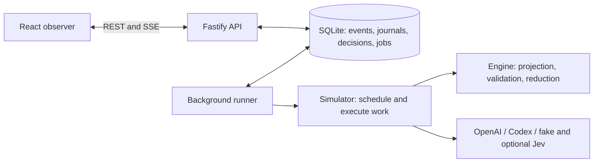
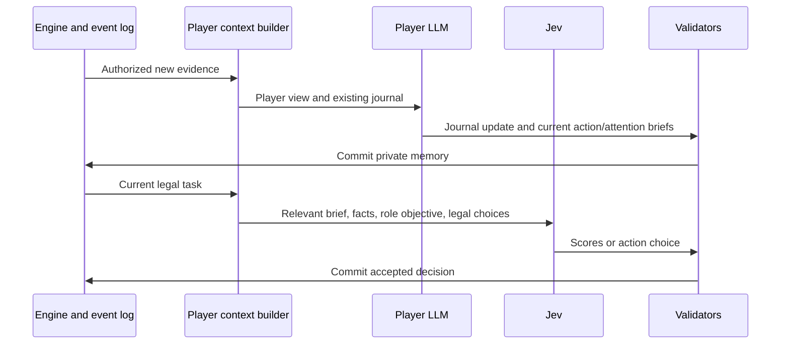

# Architecture and information boundaries

Moon Council separates peer behavior from authority. Agents can make claims, keep secrets, and
submit choices. They cannot assign roles, change another player's knowledge, resolve votes, or
declare a winner. Those operations belong to the deterministic engine.

## Processes and packages

| Location             | Responsibility                                                                              |
| -------------------- | ------------------------------------------------------------------------------------------- |
| `packages/contracts` | Versioned Zod schemas and inferred TypeScript types                                         |
| `packages/engine`    | Deterministic state transitions, roles, visibility projections, and rule validation         |
| `packages/simulator` | Discussion auctions, reflection, context construction, decisions, recovery, and experiments |
| `packages/llm`       | Provider adapters, prompt serialization, cache metadata, and structured responses           |
| `packages/db`        | SQLite persistence, migrations, event and decision repositories                             |
| `apps/api`           | Observer projections, controls, REST endpoints, and event streaming                         |
| `apps/runner`        | Durable job execution                                                                       |
| `apps/web`           | Setup, observation, replay, role workshop, and experiment UI                                |
| `scripts`            | Offline audits, bounded probes, pilots, checkpoints, and publication checks                 |

The `@werewolf/*` package names reflect the original testbed. They do not imply that
game-independent adapters already exist. `orchestrator-v2.ts` is the current orchestration entry
point; the older orchestrator and protocol modules also support archived behavior.

## What an agent can know

The engine owns the full roster, role assignments, and event log. Before each decision, the context
builder selects only information authorized for that player:

- Public events and the visible roster, including publicly revealed roles.
- Its own role, private results, and explicitly authorized team information.
- Its own journal, current brief, response obligations, and legal actions.

The player never receives the moderator's complete state. A werewolf can know authorized teammates,
but cannot read their journals. Current pack coordination exposes pointing gestures rather than a
shared private reasoning transcript. Ballots remain sealed until resolution. Claims made in speech
remain claims; they do not acquire the authority of engine-generated inspection results.

Public evidence handles (`E#`) are shared across players. Private handles (`R#`) are owner-scoped.
The application maps them back to canonical event IDs and validates citations. Speech and role
language are untrusted game data, not instructions that grant access to another player's context.

This separation is enforced in software. The unauthenticated observer API is for a trusted operator,
who can deliberately choose a moderator view. It is not a security boundary between multiple human
users. Databases, moderator exports, and exact provider-request receipts contain private game data.

## Model calls and player memory

For a selected speech, the final generation goes to the LLM instead of Jev. OpenAI requests use
`store: false`; the application reconstructs their context. Codex decisions start independent
threads. No shared conversation carries one player's private memory into another player's call.

In `journal_v4`, meaningful evidence changes trigger reflection for living players before subsequent
scoring or action. Each reflection refreshes two short briefs even when the longer journal is
unchanged. The application verifies brief ownership and an evidence revision. Attention tasks use
the attention brief; votes and night choices use the action brief. Phase changes and pack points do
not alone trigger reflection; their latest legal state is supplied directly to the decision.

The journal budget is 16,000 estimated tokens, including its brief. Overflow triggers LLM prose
compaction while preserving the current brief and its ownership/revision. Application checks can
verify size and structure, but cannot prove that a summary retained every strategic nuance. See
[actor workflow](ACTOR_WORKFLOW.md) for the exact contract.

## Determinism, failures, and replay

The seed determines role assignment and scheduler tie-breaking. Provider latency does not choose the
speaker, and validated concurrent work is committed in a defined order. Model responses themselves
are not deterministic.

Roles and game configuration are frozen per game. Events and decision attempts preserve the inputs,
accepted outputs, usage, and recovery state needed for audit and replay. SQLite uses WAL mode. The
runner claims durable jobs; provider failures have bounded retries. Exhausted or unresolved current
protocol work pauses rather than fabricating an action. Legacy V1 behavior remains replay-only.

Protocol, engine, and journal versions are separate compatibility axes. New games use the current
agent protocol on the V2 rules engine; Jev games use `journal_v4`. Archived games keep their
recorded behavior. Do not relabel an old checkpoint as a new workflow.

## Cache sharing respects visibility

The provider serializer places common behavior, frozen rules, durable public outcomes, and the
current public view before actor-specific data. A cache hit reuses prefix processing; it does not
merge conversations or give a player another player's journal. Private context follows the shared
boundaries and stays local to the request. See [cache design](OPENAI_CACHING.md) for invalidation,
measurement, and the difference between context size and cached-token accounting.
