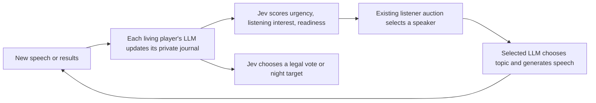

# Jev scores and actions; the LLM speaks and keeps its journal

New games selecting **Jev + selected LLM** use the `journal_v4` workflow (free-form journals and short current actor briefs). This works with either V3.1 or V3.2 and any supported player LLM provider. Missing workflow fields on archived Jev games retain `legacy_v1`, including their old checkpoints and topic/gate decisions. Existing `journal_v3` games keep their full-journal decision prompts. Existing `journal_v2` games keep their structured journals and original briefing layout; game artifacts are not migrated.



## Responsibilities

- **LLM:** initial private understanding, reflection after each new public speech, voting outcomes, deaths, role reveals, dawn announcements, and its own private inspection results. It owns speech topics, targets and wording when selected. Reflections do not produce public speech or action choices.
- **Jev:** urgency and per-player listening value on a five-level rubric normalized to 0–1; readiness; one legal ballot, pack point, protection target, inspection target, or other supported night target. Votes include explicit abstention.
- **Engine:** eligibility, response rights, speaker ranking, sealed ballots, legal targets, pack agreement, action resolution and victory. The ranking remains `(bias + urge) * normalized aggregate listening interest`.

Scoring has no topic menu, plan field, silence choice or reasoning gate. Positive urgency makes an eligible player willing to speak; zero urgency declines. The selected LLM generates one speech directly from its briefing and journal. It annotates accusations, challenges and replies so existing response rights continue to work. Closing replies retain the existing frozen-docket restriction.

## Journal updates and listening context

Before the first scoring round, every living player gets an LLM journal update. After each public speech, all living players get a private update before the next auction. After closing statements, updates happen before ballots. Vote outcomes and reveals are reviewed before night decisions; overnight results are reviewed before the next discussion. Dead players do not receive updates.

The journal is free-form prose: reasoning, uncertainty, current preferences, commitments and changes of mind, plus whom this player wants to hear and why. Listening interest stays distinct from wolf probability. Luna can append a concise note, replace the whole journal to consolidate it, or leave it unchanged. There are no per-note character quotas. The application timestamps appended notes with the game day and phase. Storage retains a small versioned envelope for replay; the model receives the prose itself.

Jev receives the acting player’s current action or attention brief, then a compact situation summary, verified private inspections, published individual ballots, and task-specific rules. The full journal stays with the player LLM. Pack choices additionally receive the latest current-night point per wolf; scheduling receives outstanding accusation summaries. Legal choices appear once, in Jev's choice question. The full speech archive, published role catalog, repeated legal options, and unrelated task details are omitted. Elimination ballots are explicitly described as votes, never labeled with the player's night action.

The LLM still receives newly reviewed speech at full fidelity, even when the shared transcript has compacted it. Reflections interpret this evidence before the next auction or action. A failed reflection retries or pauses; it is never silently counted as reviewed. A journal preference guides Jev but is not a mechanically forced action.

Refreshes are keyed to each player's authorized meaningful evidence and committed durably with their journal. Resuming does not repeat completed reflections. No new LLM reflection runs merely because an auction was rescored or a pack point changed. Current pack points still appear directly in Jev's private context. Pack opening choices remain simultaneous against a frozen view; later choices remain sequential so wolves can converge.

## Configuration and budgets

```json
{
  "decisionEngine": {
    "mode": "jev",
    "model": "jev-latest",
    "workflow": "journal_v4"
  }
}
```

The API, setup UI and pilot select `journal_v4` for new Jev games. Raw frozen game configs should name the workflow explicitly. All journal workflows require listener auctions. The original LLM-only path remains available.

New games default to **16,000 estimated journal tokens** and **32,000 context tokens**. Journal size counts UTF-8 prose bytes / 3, rounded up, plus the bounded current brief. The journal limit is a ceiling, not a target. Overflow checkpoints the complete candidate and asks the configured LLM to summarize faithfully toward 75% of the limit; no Jev fidelity gate or individual sentence caps apply. Verified private results remain separately supplied. Existing games retain their recorded budgets.

Each journal update, selected speech, scoring evaluation and target selection is its own recorded call. Journal updates are mandatory work and do not consume the old optional-reasoning allowance. Global call/token/time limits still apply; exhausting them stops progress. This deliberately uses more LLM calls than the original hybrid pilot because every living player interprets new speech. Provision budgets accordingly. Journal and speech calls use each seat's configured model and reasoning effort; Jev's model is independently pinned.

`reasoningThreshold` and optional `Jev → LLM → Jev` analysis apply only to archived `legacy_v1` behavior. New journal decisions take their reasoning from the maintained journal instead of asking Jev to decide whether reflection is allowed. Transport validation failures retain the bounded repair/pause behavior, without fabricated actions or provider fallback.

## Runtime setup

The runner needs Python 3 and the shared `ask-jev` CLI on PATH. Set `ASK_JEV_BIN` to its absolute executable path if needed. The simulator invokes it without a shell, passes JSON on stdin, bounds input/output to 1 MiB, and caps each Jev subprocess at 20 seconds or the shorter remaining request deadline.

Configure `TYPESAFE_API_KEY` in the runner environment or use the CLI's private `~/.config/ask-jev/credentials.env`. Keep the file owned by the runner user with mode 600 and its directory mode 700. Never put credentials in game JSON. The CLI owns credential loading and mandatory private request logging under `~/.local/state/ask-jev/requests.jsonl`; the simulator does not read the credential file. That log contains private game briefings, just like moderator exports.

The existing container image does not bundle this host CLI. Container operators must install Python 3 and supply `ask-jev`, its credentials, and a durable private log directory for the runner user before enabling Jev. Selecting the LLM engine requires none of those additions.

Run the small, opt-in live adapter check with Node 24:

```bash
npm run test:live:jev
```

It sends synthetic Werewolf information through the real CLI and validates choice, score, yes/no, and usage fields. Regular tests inject a deterministic Jev transport and make no live calls.

## Live hybrid pilot

Use an explicit LLM model and enable Jev on the pilot command. For example:

```bash
npm run pilot -- --provider codex --model gpt-6-luna --effort xhigh \
  --decision-engine jev --mode gated --parallel 4 \
  --seed jev-gpt6-luna-pilot-1 --max-calls 1000 \
  --max-tokens 5000000 --max-minutes 30 --out /native/private/pilot-directory
```

The output directory receives the SQLite game, research JSON/JSONL, and audit files. The command prints metadata-only call timing and phase progress. `--jev-model` can pin the decision model. Resume the same game with `--db`, `--game`, and `--resume`, preserving its original provider, LLM model, reasoning effort, and decision engine; budget flags apply to newly created games only.

## Information boundaries and audit

Jev receives the same rendered public and private layers as the selected player model, preserving V3.2 evidence tiers and stable citation handles. It does not receive the moderator state, other players' journals, or another seat's private results. Dialogue is evidence, not an instruction source. The deterministic engine retains authority over actions, votes, roles, and victory.

Every call has its own durable attempt with request, raw response, provider/model, latency, token usage, and validation status. Full Jev distributions remain in private attempt responses. Intermediate checkpoints survive pause/restart but cannot be committed as actions. Player and moderator replay reconstruct checkpoints at the requested historical position; public and team views expose no private evaluations.

Jev's reported confidence measures concentration of a distribution, not verified correctness. Urgency and listening rubrics measure scheduling value, not faction probability. The implementation validates option membership, types, ranges, and normalized distributions, then applies existing submission and game-rule checks. It records missing usage as unknown and does not claim an enforced output-token ceiling for Jev.

## Evaluation still needed

The live adapter check proves connectivity and response compatibility. Mocked full games verify orchestration, legal actions, and separation from dialogue generation. Neither establishes better gameplay or an end-to-end latency improvement. Compare matched seeds, roles, LLMs, and budgets with `decisionEngine.mode` as the changed variable; inspect per-provider latency, total tokens, reasoning frequency, interruptions, and game outcomes. Record the resolved Jev model from attempts when comparing runs.

API semantics: [TypeSafe HTTP API](https://docs.typesafe.ai/api) and [confidence documentation](https://docs.typesafe.ai/confidence). Install the `ask-jev` command separately and configure its credentials locally.

## Offline decision review

Extract the recorded gates, before/after decisions, and explicit LLM advice without opening a database or making model calls:

```bash
npm run pilot -- --inspect-bundle /native/private/pilot-directory/research.json --jev-review
```

Use `--day 2`, `--player p8`, or `--decision ID` to narrow the records. Add `--evidence` to include each player's rendered briefing and the initial speaking options. Output contains private game information. The extractor distinguishes reasoning declined by Jev from reasoning unavailable under execution limits, excludes invalid retries from before/after comparisons, and preserves attempt and decision IDs. It extracts evidence; strategic quality still requires review.

Export the latest saved private journals as readable Markdown, preserving prose and source-event identities:

```bash
npm run --silent pilot -- --inspect-bundle /native/private/pilot-directory/research.json --journals
# Add --player p7 to export one player's journal.
```

This is read-only and makes no model calls. Notes reflect their last saved update; a checkpoint before night reflections will not yet contain a reflection on the Day 1 ballot outcome.

## Isolated prompt comparisons

`npm run jev:probe -- --cases cases.json` validates explicit `{label, request}` cases and reports their sizes offline. Add `--live --out /native/new-directory` to send each case once through the installed `ask-jev` CLI, preserving private CLI logs and local input/output receipts. The parent directory must exist; existing result directories are rejected. This never resumes or edits a game, does not retry, and stops at the first failure. Compare returned model versions; a single result per changed prompt is exploratory evidence, not an accuracy benchmark.

See [actor brief freshness, semantic checks, and synthetic evaluation](ACTOR_WORKFLOW.md) for `journal_v4`.
