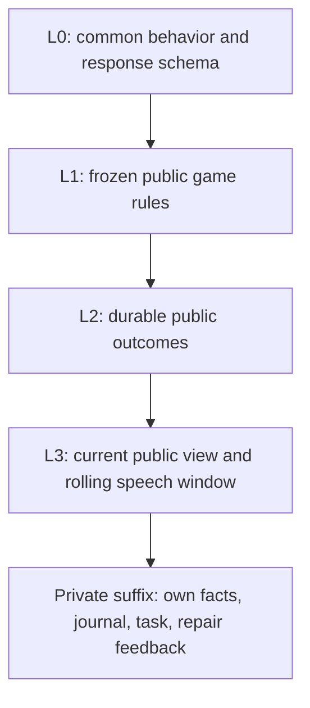

# OpenAI API and cache design

New local setup uses the OpenAI Responses API with `gpt-6-luna`; Jev still scores urgency/listening
and selects votes and night actions. Luna still generates speech and updates each living player's
notebook. Provider migration does not change that division.

## Configuration

Set these in the ignored root `.env` or the process environment:

```dotenv
LLM_PROVIDER=openai
OPENAI_MODEL=gpt-6-luna
OPENAI_REASONING_EFFORT=xhigh
OPENAI_API_KEY=your_api_key
```

API, runner, and pilot load the same optional `.env`; existing process variables take precedence.
Keys never enter the browser, request audit bodies, or SQLite. Use `LLM_PROVIDER=fake` for offline
development. Archived games retain their frozen model/provider and output budget; the runner refuses
to resume a game through a different provider. Start a new game for this migration.

New games have no total-token ceiling (`maxTotalTokens: null`; CLI `--max-tokens unlimited`). A
numeric limit remains available, and archived finite budgets keep their original meaning. Token
usage is still counted and reported.

New setup and CLI pilots default to 8,192 output tokens per ordinary API call, including reasoning
and final JSON. Unlimited-token games omit that cap for compaction and for retries after an explicit
`max_output_tokens` truncation. This retry policy also applies after recovery from a saved failed
attempt. A truncated gameplay retry may use the remaining decision-episode time, recorded as
`timeoutMs` on its attempt; ordinary calls and compaction keep the configured per-request timeout.
The API enforces that total ceiling. The earlier 250–900 task limits describe small final responses
and are inappropriate as total reasoning-inclusive limits. Existing structured limits still
constrain speech and notebook size. Usage receipts and conservative unknown-usage reservations
include the configured output ceiling. `incomplete` responses are rejected even if partial text
happens to be valid JSON; they never become a successful move. No SDK retries run outside the
attempt ledger.

## Notebook compaction

Current Jev games use `journal_v4`: free-form journals plus current action/attention briefs. They
keep journals with a 16,000 estimated-token ceiling and a 32,000 context budget. Routine reflections
append concise prose or replace the journal to consolidate it. Prose size is UTF-8 bytes / 3,
rounded up. The v4 aggregate also charges the serialized current decision brief; journal storage
metadata is excluded. The larger budget is not a target to fill. Compaction preserves the brief, its
owner, and its evidence revision exactly. See [the actor workflow](ACTOR_WORKFLOW.md) for brief
limits and freshness checks.

When an update exceeds the limit, its complete candidate is checkpointed without acknowledging the
reflection. The configured player LLM summarizes the prose toward a soft 75% target, retaining
current reasoning, uncertainty, commitments, listening preferences and deception. There are no
per-note quotas and no Jev fidelity judge. The application checks nonempty prose, aggregate size and
version; semantic fidelity still depends on the summarizer. Authoritative inspections remain
separately available to Jev. Archived `journal_v2` games retain their structured compactor and
metadata checks.

Compaction uses the recorded provider-attempt path, low OpenAI reasoning effort, and bounded
repairs. Failures pause the game; recovery retains the candidate and prior drafts. A valid
replacement commits once with a private `journal.compacted` before/after event, then acknowledges
the reflection. Shared game cache layers remain unchanged. API games without an aggregate token
ceiling omit `max_output_tokens` for compaction; finite-budget games retain their configured output
cap. Request and episode timeouts still apply.

## Request layout

`packages/llm/src/openai-cache.ts` is the shared serializer used by the provider and probe.
V3.1/V3.2 use at most four explicit write boundaries on GPT-5.6 and later:

| Layer           | Content                                                                                                                  | Invalidated by                                                              |
| --------------- | ------------------------------------------------------------------------------------------------------------------------ | --------------------------------------------------------------------------- |
| L0              | Immutable behavior instructions and the common strict response format                                                    | Behavior, roster-dependent schema, model or reasoning configuration changes |
| L1              | Frozen public game rules and role catalog                                                                                | Changed game configuration                                                  |
| L2              | Durable public outcomes: ballots, eliminations, role reveals and moderator announcements                                 | A new or corrected durable outcome                                          |
| L3              | Current public view, including the rolling speech window, phase/day and alive roster                                     | New speech, window movement or phase changes                                |
| Uncached suffix | This player's authorized private facts, notebook, selected evidence, response docket, immediate task and repair feedback | Player or decision changes                                                  |



A cache match depends on the preceding prefix: changing L1 prevents reuse of the old L2/L3 prefix,
while changing only the private suffix leaves all four shared prefixes intact. These are request
layout layers, not independently addressable application caches.

Each boundary remains within the API's four-write limit. The earlier per-record layout marked so
many endpoints that only its last four could be written, crowding out the immutable boundaries. It
also put a shifting speech window before durable facts. Separating these layers keeps the rules and
durable outcomes reusable when the window moves. This reorders the supplied facts without adding,
deleting, expanding or changing evidence; E references retain chronological identity. It does not
add omitted public records or another player's private knowledge.

Journal updates, free speeches and closing responses share one strict API envelope
(`moon_council_reflection_speech_v2` for prose journals, `v1` for archived structured journals). Its
schema and instructions are byte-identical across those tasks for a given roster. The envelope
carries a task discriminator, memory, optional speech, and rationale. It is decoded into the
original task response, then checked by the original strict schema and domain validators. A journal
cannot contain speech; closing still forbids new accusations; wrong-task answers are rejected. In
the prose workflow, memory is a single optional append/replace update and speech tasks cannot change
it. Jev uses its separate typed scoring/choice contract. Context sizing includes the API envelope
before selecting evidence.

The minimum eligible prefix is 1,024 visible tokens; the configured TTL is 30 minutes. No padding or
warm-up calls are added. Cold concurrent requests may all miss; the normal concurrency setting
remains available. These are API limits, not local cache guarantees.
[OpenAI prompt caching](https://developers.openai.com/api/docs/guides/prompt-caching)

The game-scoped cache key is stable across seats and decisions. Requests use `store:false` with no
conversation or previous-response state. Private notebooks stay request-local. Other models/task
families can still have incompatible schemas or reasoning settings; reuse is measured, not assumed.
Older models use their supported implicit caching and a stable key.

Caching reduces fresh input processing and changes billed input categories; it does not erase tokens
from the context or the simulator's total-token budget. On GPT-6 Luna, cached reads use 0.1× and
writes 1.25× the ordinary input rate. Input, cached input, and cache-write categories must not be
double-counted. Actual latency and savings require measurement.
[GPT-6 Luna](https://developers.openai.com/api/docs/models/gpt-6-luna)

## Audit and verification

Moderator attempt records include the exact unauthenticated wire request, returned model, response
status, incomplete reason, response ID, and cache diagnostics. Credentials and hidden reasoning are
never recorded. These records contain private game context and follow the existing moderator-only
attempt visibility. Historical replay hides response metadata until the receipt event.

Diagnostic comparison IDs are scoped to game/model/schema/settings, expire locally after 30 minutes,
and are retained only for completed responses in a bounded in-memory map. Process restarts clear
diagnostic baselines without changing prompt construction or game state. The archived-replay probe
can explicitly compare successive recorded tasks across schema families; that override requests
diagnostics only. Comparisons do not replay any previous response. Usage counters, rather than
diagnostic labels, determine actual reuse.
[OpenAI cache diagnostics](https://developers.openai.com/api/docs/guides/prompt-caching/diagnostics)

```bash
# Offline: build three synthetic journal prompts without calling a model.
npm run cache:probe -- --out data/pilots/api-cache-dry-run

# Live: exactly three calls, no retries, each at most 8,192 output tokens / 120 seconds.
# Cold prefix, a different player reading the same evidence, then an appended speech.
npm run cache:probe -- --live --model gpt-6-luna --effort xhigh --out data/pilots/api-cache-live

# Replay actual recorded Codex requests without modifying the source game.
# Select up to 12 validated attempt IDs. Source model/effort/packet are preserved.
npm run cache:probe -- --live --db SOURCE.db --game GAME_ID --attempt ATTEMPT_1 --attempt ATTEMPT_2 --out data/pilots/api-archive-test

# Offline comparison verifies matching source hashes, model, effort and sample order.
npm run cache:probe -- --compare BASELINE/summary.json --compare REVISED/summary.json --report REPORT.md

# New game; provider/model/effort and budgets are frozen in the game record.
npm run pilot -- --provider openai --model gpt-6-luna --effort xhigh --decision-engine jev --max-output-tokens 8192 --out data/pilots/api-luna-jev

# Partial game: finish Day 1 ballots, then pause before any Night 1 work.
# The checkpoint exits successfully and exports the normal research bundle.
npm run pilot -- --provider openai --model gpt-6-luna --effort xhigh --decision-engine jev --pause-at-first-night --snapshot --out data/pilots/api-luna-first-night

npm run cache:audit -- --db data/pilots/api-luna-jev/game.db --game GAME_ID --json
```

The cache audit separates provider/model totals, cache reads, writes, ordinary uncached input,
unknown accounting, and miss reasons. Jev's unreported cache usage is excluded from the known-cache
denominator, rather than counted as a cache miss. Probe output directories and comparison report
paths must be new, preserving earlier receipts. The live probe writes exact request/receipt files
and applies the normal journal/schema/domain validation, stopping on its first failure. It is a
cache integration check, not evidence of complete-game playing strength. Historical Codex latency is
labeled separately from sequential API measurements; schema/layout changes and ordinary generation
variance prevent attributing all latency changes to caching.

## Recorded decision experiment

Five Day 2 requests from the Luna/Jev pilot were replayed twice: two players reflecting on the same
public state, a free speech, then two reflections after the public window changed. Every recorded
prompt, selected evidence item, model and reasoning effort stayed fixed; only API
serialization/output format changed. All ten replies passed the game validators.

| Measure across five requests | Initial API layout | Four-layer API |
| ---------------------------- | -----------------: | -------------: |
| Input tokens                 |             24,470 |         25,453 |
| Cache reads                  |      4,924 (20.1%) |  9,989 (39.2%) |
| Cache writes                 |              7,467 |          3,385 |
| Median wall time             |            19.36 s |        15.71 s |

The original Codex calls used 67,131 input tokens with a 35.26 s median. Cache percentages alone are
misleading: Codex also cached its additional wrapper context. The useful comparison includes
absolute input, uncached input, cache writes, output/reasoning, and latency. The speech crossed task
families and received `cache_hit` with 2,666 reused tokens. The changed public window retained 1,969
tokens and wrote only 719; its diagnostic was `unavailable`, so usage rather than that label
establishes reuse.

Local receipts and the detailed report are in `data/pilots/api-archive-baseline-live/` and
`data/pilots/api-archive-layers-live/`. Those ignored artifacts contain private game context.
Further gains require revisiting the player-specific older public evidence in the uncached suffix;
this change deliberately preserves the original information boundary and selection.
