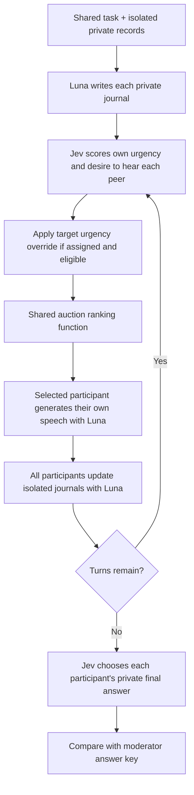

# Studying the speech auction independently of Werewolf

Moon Council studies peer interaction under unequal information. Werewolf is one environment for
that work. This protocol tests the same ranking function in cooperative discussions with synthetic,
verifiable answers, without roles, elimination, night actions, or game-specific prompts.

## Questions and predeclared outcomes

1. Does rambling reduce peers' willingness to listen, and does forced urgency offset that reduction?
2. Does the auction let a participant holding decisive evidence obtain the floor?
3. Do attention changes improve the group's answer, or merely redistribute airtime?
4. When someone is incorrectly blamed, do peers still want to hear their correction?

The primary outcomes are the target's share of committed speeches, final-minus-initial listener
rating, and the fraction of participants choosing the correct final answer. Secondary outcomes are
text-length share, wins per eligible auction, witness waiting time, final-answer Brier score,
unique-plurality group answer, original/effective urgency, and frozen-auction winner changes. Text
length counts UTF-16 code units; it is a proxy for volume, not elapsed speaking time.

A target that cannot bid because it just spoke is **ineligible**, not rejected by listeners. A
willing eligible target that loses is recorded separately from a target declining. A witness never
heard after evidence becomes available has a censored wait, not a zero wait. First speech does not
prove that they actually conveyed their evidence; inspect its content.

## Factorial design

| Condition        | Target's public speech                            | Target's urgency       |
| ---------------- | ------------------------------------------------- | ---------------------- |
| focused-natural  | Concise, evidence-focused                         | Jev's original score   |
| focused-forced   | Concise, evidence-focused                         | Set to 1 when eligible |
| rambling-natural | Repetitive, digressive, little actionable novelty | Jev's original score   |
| rambling-forced  | Same rambling instruction                         | Set to 1 when eligible |

All participants remain rational in private and pursue the same task. The rambling instruction
changes public expression; it does not prescribe urgency, whom peers should prefer, or false
records. The target holds a redundant record in every condition. A separate participant holds the
key correction or disqualifying fact. This distinguishes floor capture from intentionally
withholding the only answer. It limits inference about a rambler who alone holds decisive
information.

A scenario/seed pair is a matched block: same names, evidence ownership, target, model, instruction
version, turn budget, and tie order. Condition execution order is deterministically shuffled. Seeds
shuffle evidence ownership and tie order; they do not make model output deterministic. The manifest
freezes every input and the source commit before calls. Different tasks are not seed replications.

For each outcome, with cells A=focused-natural, B=focused-forced, C=rambling-natural,
D=rambling-forced, the report calculates:

- urgency effect: `((B - A) + (D - C)) / 2`;
- rambling effect: `((C - A) + (D - B)) / 2`;
- interaction: `(D - C) - (B - A)`.

Only complete four-cell blocks contribute these contrasts. Missing outcomes stay null. Keep all
failures in the run inventory. Report every block before any cross-task average. Twelve discussions
(one seed × three tasks × four conditions) form an exploratory pilot, not a significance test. A
replication stage should add seeds within each task using the same frozen protocol, then report
seed-level distributions. Individual auctions and listeners within one discussion are dependent
observations and must not inflate the experimental sample size.

## Tasks and timing

| Task                     | Information asymmetry                                                  | Ground truth                           |
| ------------------------ | ---------------------------------------------------------------------- | -------------------------------------- |
| Supplier selection       | Accessibility and delivery records are distributed                     | Birch is the only eligible supplier    |
| Incident diagnosis       | A causal intervention result arrives privately after turn 6            | Client retry logic causes the incident |
| Correcting an accusation | A blamed participant holds an on-time receipt; peers hold service logs | Repair the notification service        |

Only the moderator artifacts contain all private records and the answer key. Each participant sees
the shared task, their own records and prose journal, and the public transcript. Late evidence is
unavailable until its scheduled arrival. The recipient updates their journal before their next bid.
Task answers are collected privately before discussion and again after the last speech's
reflections. The initial answers give an information baseline and are never disclosed to peers. Jev
answers from that participant's perspective; its uncertainty remains in the probability vector.

## Discussion protocol



Four participants, twelve auction turns by default, speaker bias 0.25. Rankings use
`(bias + urgency) × normalized listening interest`. The last speaker is excluded from the next
auction. There are no guaranteed opening turns, personal speech caps, closing speeches, response
quotas, or readiness termination. An auction with no willing candidate consumes a turn without a
speech. This isolates ranking under a fixed opportunity budget; it does **not** reproduce the full
Werewolf scheduler. Studying scheduler policies is a separate factor for a later experiment.

Jev receives the actor's current prose journal, own verified records, task, and public speaking
counts. It rates all other participants even while ineligible itself. The mean expected 0–4 score is
normalized to 0–1. The intervention replaces only the eligible target's urgency/participation; it
preserves original answers and every listening rating. Luna independently writes the selected
speech, then everyone reflects. No model chooses another participant's words or journal.

The unforced counterfactual reranks a recorded auction with its original urgency and participation,
holding all recorded beliefs, ratings, eligibility and tie order fixed. This can explain an
immediate winner change; it does not estimate an entire alternative conversation.

## Manipulation checks and qualitative analysis

A rambling instruction is not evidence that rambling occurred. Inspect every condition's speeches.
The generated coding packet hides condition and target labels, though wording can reveal them. Read
each discussion in order. Score relevance (0 unrelated, 1 partly useful, 2 directly useful), novelty
(0 repetition, 1 peripheral addition, 2 actionable evidence/reasoning/correction), and how much is
off topic (0 none, 1 minority, 2 majority). Record an excerpt-based rationale. Null means
unreviewed. Prefer two independent raters and report disagreement before reconciliation.

Do not infer signal from length alone. Check whether the decisive record was actually communicated,
whether the recipient was answering a legitimate request, and whether listeners distinguish
credibility from desire to hear a correction. Trace rating changes to contemporaneous journals,
including contrary or neutral reactions. Initial-to-final ratings are descriptive: other speeches
also intervene. A low-signal manipulation that fails to materialize limits conclusions; keep that
run rather than quietly replacing it with a stronger prompt.

## Running and artifacts

```sh
# Preview the frozen design without writing artifacts or calling providers.
npm run auction:study

# Mechanical validation only, or a live 12-discussion pilot.
npm run auction:study -- --fake --out data/auction-offline
npm run auction:study -- --live --out data/auction-pilot

# More within-task replication; 24 discussions.
npm run auction:study -- --live --seeds replication-1,replication-2 \
  --out data/auction-replication

npm run auction:study -- --status --out data/auction-pilot
npm run auction:study -- --report --out data/auction-pilot
npm run auction:study -- --resume --out data/auction-pilot
```

Live mode uses the existing OpenAI Responses and Ask Jev providers, with layered prompt caching, no
application output-token ceiling, no automatic retries, and exact per-attempt input/output/usage
records. The immutable shared task/public transcript precedes the actor's private data. Private
journals are prose inside a small response envelope. Shared caching does not share private context.

By default at most two discussions run concurrently, each with at most four simultaneous model
calls. Each discussion has a thirty-minute active wall-time bound, a three-minute LLM call timeout,
and at most `16 + 9 × turns` attempts. Jev retains its existing twenty-second call timeout. There is
no total-token ceiling. These limits bound operations rather than guarantee a dollar cost.

Runs require a clean committed source tree and a fresh output directory. Resume requires the same
source commit and frozen manifest. It starts only untouched discussion directories; failed or
interrupted discussions are never automatically retried or overwritten. A process lock prevents
concurrent schedulers. If a process dies, inspect the recorded PID before manually removing its
stale lock. Partial results remain available for inspection and exclusions are explicit.

Each discussion writes `checkpoint.json` after every phase, with complete isolated journals,
original and effective bids, speeches, and final answers. `attempts.jsonl` retains exact model
requests, responses, failures, timing, and measured usage. The root manifest includes answer keys;
`analysis.json`, `report.md`, and `coding-packet.json` are derived private analysis. Keep these in
ignored local storage, never in the public repository. Regenerating the report does not overwrite an
existing coding packet and its annotations; generate that packet after the batch finishes.

A later study can vary cooperation versus conflicting incentives, group size, arrival timing,
several disruptive speakers, scheduler guardrails, and evidence quality. Change one planned factor
at a time and do not pool changed protocols as interchangeable trials.

For targeted local inspection and an independent recomputation of report ratios:

```sh
python3 scripts/study-inspect.py --study data/auction-pilot --verify
python3 scripts/study-inspect.py --study data/auction-pilot \
  --run b01-supplier-rambling-forced --details --turn 7
```

This read-only companion can include private journals when `--details` is explicit. It never calls a
model. `--verify` compares independently calculated floor share, text share, accuracy, and
changed-winner counts against the saved analysis. Run it after the batch and report finish.

The next [chained-evidence protocol](CHAINED_EVIDENCE_STUDY.md) gives each of four participants an
essential dependent record and crosses rambling with a separate strategic saboteur. An independent
backup keeps that task collectively solvable. Its eight conditions and route probes are a separate
experiment.
